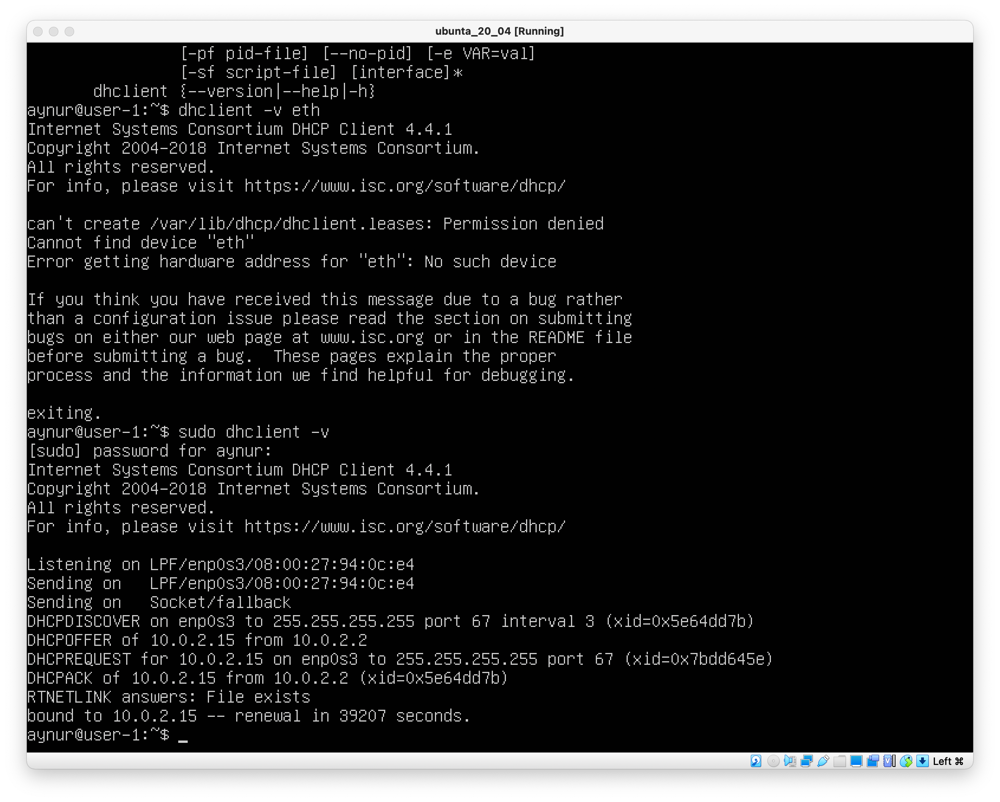
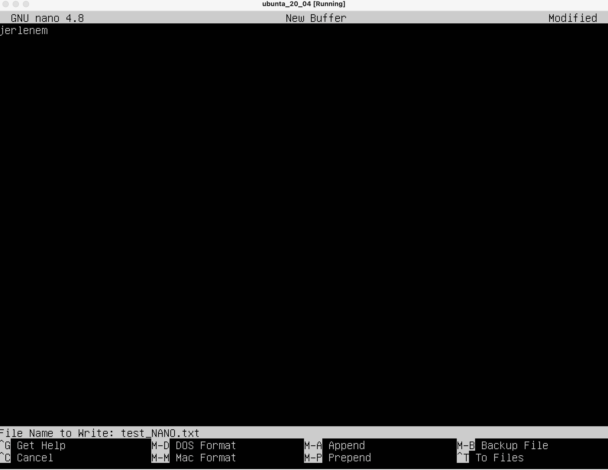
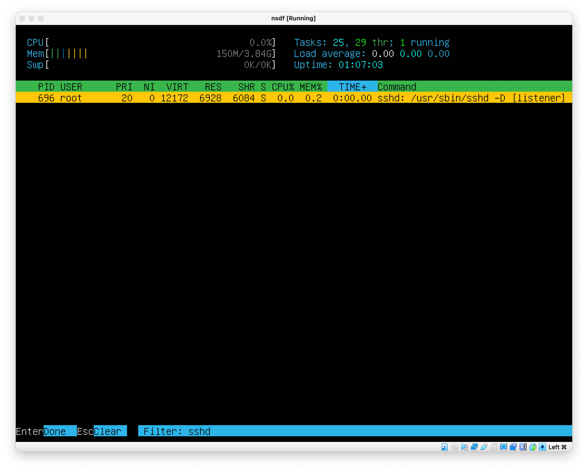
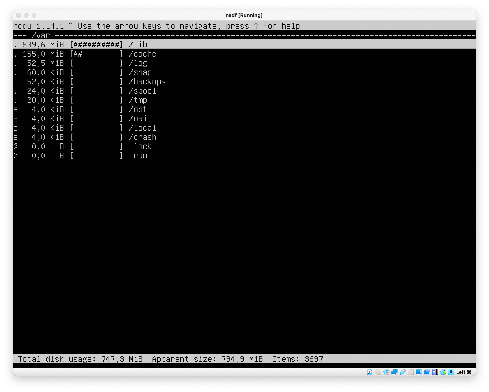

Part 1
------

Версия UBANTU, ``cat /etc/issue``
    

Part 2
------

1.  Создание нового пользователя ``sudo useradd -G adm user2``
    

2.  Просмотр нового пользователя ``cat /etc/passwd``
    

Part 3
------

1. Задать название машины вида user-1
    ``sudo nano /etc/hostname`` - далее изменил название в редакторе
    
2. Изменил часовую зону 
    ``sudo timedatectl set-timezone Europe/Moscow``
    
3. Просмотрел сетевые интефейсы - ``ifconfig -a``
    

    Сетевой интерфейс — физическое или виртуальное устройство, предназначенное для передачи данных между программами через компьютерную сеть.
    Сетевое взаимодействие Linux-компьютера происходит через сетевые интерфейсы. Любые данные, которые компьютер отправляет в сеть или получает из сети проходят через сетевой интерфейс.
    Интерфейс определён реализацией модели TCP/IP для того чтобы скрыть различия в сетевом обеспечении и свести сетевое взаимодействие к обмену данными с абстрактной сущностью.
    lo - это    интерфейс петли обратной связи.
    Одна из задач технологии обратной петли — перенаправлять исходящий системный пакет на вход системы, не давая ему попасть к OSI. Если попроще, вот так работает данный интерфейс: Кроме того, интерфейс loopback осуществляет взаимодействие исполняемых на одном хосте процессов с сетевой подсистемой. Есть и полная схема осуществления loopback интерфейса: Сфера применения интерфейса обратной петли довольно объемная. Ее используют и в системе pfSense — дистрибутив, создающий межсетевой экран/машрутизатор. В таком случае loopback нужен в качестве метода взаимодействия между локальными процессами через сетевую подсистему.

4. Используя консольную команду ``sudo dhclient -v`` получить ip адрес устройства
    

    Протокол динамической настройки хоста (DHCP) — это сетевая служба, которая позволяет хост-компьютерам автоматически назначать настройки с сервера, а не вручную настраивать каждый сетевой хост. 
    Клиент настроенный на получение адреса по протоколу DHCP посылает запрос к серверу, и тот в свою очередь предоставляет свободный IP адрес клиенту во временное пользование — так сказать в аренду (в дальнейшем я буду это так и называть). Срок аренды IP адреса настраивается на сервере. DHCP позволяет значительно уменьшить затраченное время на настройку сети, так же позволяет подключать клиента из одной сети в другую без изменения сетевых параметров. Для провайдеров услуг — DHCP позволяет съэкономить на пуле IP адресов, и присвоить статический IP любому оборудованию.

5.  Определил внешний ip-адрес шлюза ``curl ifconfig.me/ip`` (ip) и внутренний IP-адрес шлюза ``ip route``
    

6. Задал статичные настройки ip, gw, dns - ``sudo nano /etc/netplan/00-installer-config.yaml``
    

7. успешно пропинговал 
    

Part 4
------

Обновил пакеты 
    

Part 5
------

Sudo - позволяет выполнять привилегированные команды обычным пользователям без необходимости ввода пароля суперпользователя root 

Поменял хост найм от имени 2 польз. ``sudo hostname user-2`` 
    

Part 6
------

Настроил службу автоматической синхронизации времени
    

Part 7
------

1. 
Создал файл text_VIM.txt в vim, для выхода с сохранением изменений - esc - SHFT + : - qw  - name file
    

Создал файл text_NANO.txt в nano, для выхода с сохранением изменений - cntrl + x - yes - name file
    

Создал файл text_MCEDIT.txt в mcedit, для выхода с сохранением изменений - esc - 2 - yes - name file
    

2. заменил текст в файл text_VIM.txt в vim, для выхода без сохранением изменений - esc - SHFT + : - q! 
    

заменил текст в файл text_NANO.txt в nano, для выхода без сохранением изменений - cntrl + x - no
    

заменил текст в файл text_MCEDIT.txt в mcedit, для выхода без сохранением изменений  - esc - no
    

3. 
  после поиска в vim
    

команда для замены :%s/jerlenem/aynur
    

  после поиска в nano
    

команда для замены Ctrl+\ - jerlenem - aynur - y
    

  после поиска в mcedit
    

команда для замены ESC 4- jerlenem - aynur
    

Part 8
------

1. Для установки ИСПОЛЬЗОВАЛ КОМАНДУ 
    ``sudo apt install openssh-server -y``

2. Добавил автостарт службы
    ``sudo systemctl enable ssh``

3. Перенастроил службу SSHd на порт 2022.
    

4. Используя команду ps, показал наличие процесса sshd

Команда ps выводит список текущих процессов на вашем сервере.
Флаг -с для фильтрации по группам 
        ``ps -C sshd``
    

5. netstat (network statistics) — утилита командной строки, выводящая на дисплей состояние TCP-соединений.
    Опции –t показывают активные соединения TCP, флаг –a , также будут показаны сокеты, ожидающие соединения, -n показывает сетевые адреса как числа. netstat обычно показывает адреса как символы. Этот дисплей даст вам список всех серверов, которые в настоящее время работают в вашей системе.

    

Part 9
------
top - интерактивный просмотрщик процессов

Ввел команду top 

Cписок процессов
    

pid процесса занимающего больше всего памяти 
    ``ps -eo pid,ppid,cmd,%mem --sort=-%mem | head``
    

pid процесса, занимающего больше всего процессорного времени
    ``top -o %MEM -b -n 1|head -n 12|tail -6``
    

-A, -e, (a) - выбрать все процессы;
-a - выбрать все процессы, кроме фоновых;
-d, (g) - выбрать все процессы, даже фоновые, кроме процессов сессий;
-N - выбрать все процессы кроме указанных;
-С - выбирать процессы по имени команды;
-G - выбрать процессы по ID группы;
-p, (p) - выбрать процессы PID;
--ppid - выбрать процессы по PID родительского процесса;
-s - выбрать процессы по ID сессии;
-t, (t) - выбрать процессы по tty;
-u, (U) - выбрать процессы пользователя.
Опции форматирования:

-с - отображать информацию планировщика;
-f - вывести максимум доступных данных, например, количество потоков;
-F - аналогично -f, только выводит ещё больше данных;
-l - длинный формат вывода;
-j, (j) - вывести процессы в стиле Jobs, минимум информации;
-M, (Z) - добавить информацию о безопасности;
-o, (o) - позволяет определить свой формат вывода;
--sort, (k) - выполнять сортировку по указанной колонке;
-L, (H)- отображать потоки процессов в колонках LWP и NLWP;
-m, (m) - вывести потоки после процесса;
-V, (V) - вывести информацию о версии;
-H - отображать дерево процессов;

htop – основанный на ncurses просмотрщик процессов подобный top, интерактивные просмотрщики процессов, но позволяющий прокручивать список процессов вертикально и горизонтально, чтобы видеть их полные параметры запуска. Управление процессами (остановка, изменение приоритета) может выполняться без ручного ввода их идентификаторов.

Ввел команду htop 

список процессов 
    

отсортированному по PID
    
    
отсортированному по PERCENT_CPU
    

отсортированному по PERCENT_MEM

отсортированному по TIME

отфильтрованному для процесса sshd

с процессом syslog, найденным, используя поиск

с добавленным выводом hostname, clock и uptime

Part 10
------

Название жесткого диска sda 
Размер 20,61g 
Кол-во сектаров 40044544
Размер Swap (команда ``free -m``) - no swap

Использование утилиты fdisk

Part 11
------

Размер раздела 10255636 
размер занятого пространства 2707604
размер свободного пространства 7007360
процент использования 28%
Ед. из. киллобайт

Использование утилиты df

размер раздела 9,8G
размер занятого пространства 2.8G
размер свободного пространства 7.7G
процент использования 28%
type exit4

Использование утилиты df -Th

Part 12
------

размер папок /home - 107626

размер папок /var - 778007642

размер папок /var/log - 55228052

размер всего содержимого в /var/log (не общее, а каждого вложенного элемента, используя star)

Part 13
------
ncdu /home
    

ncdu /var
    

ncdu /var/log
    

Part 14
------

1. /var/log/dmesg
    

2. /var/log/syslog
    

3. /var/log/auth.log
    

 время последней успешной авторизации, имя пользователя и метод входа в систему.
    

Вставить в отчёт скрин с сообщением о рестарте службы (искать в логах).
    

Part 15
------
 
текущих заданий для CRON.
    

 отчёт скрины со строчками о выполнении и списком текущих задач.
    

Удалил все задания из планировщика заданий.
    
